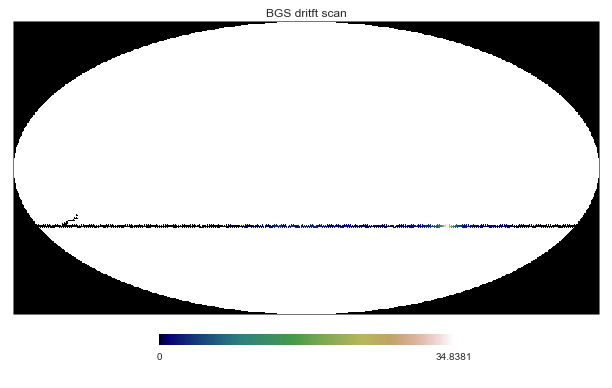

========
Usage
========

To use SEEK, you can download the example data that was collected at the Bleien Observatory::

	$ wget -r -nH -np --cut-dirs=2 http://people.phys.ethz.ch/~ast/cosmo/bgs_example_data/

then you will be able to process the data with seek::

	$ seek --file-prefix=./bgs_example_data --map-name=BGS_maps.hdf --verbose=True seek.config.process_survey_fft
	
further option can be found in the `seek.config.process_survey_fft`

Finally, you can visualize the resulting map like this::

	import h5py
	import healpy as hp
	
	with h5py.File("./BGS_maps.hdf", 'r') as fp:
	    bgs_map = fp['MAPS'][20, 0]
	    counts = fp['COUNTS'][20, 0]
	
	bgs_map[counts==0] = hp.UNSEEN
	hp.mollview(bgs_map, cmap="gist_earth")
	

	